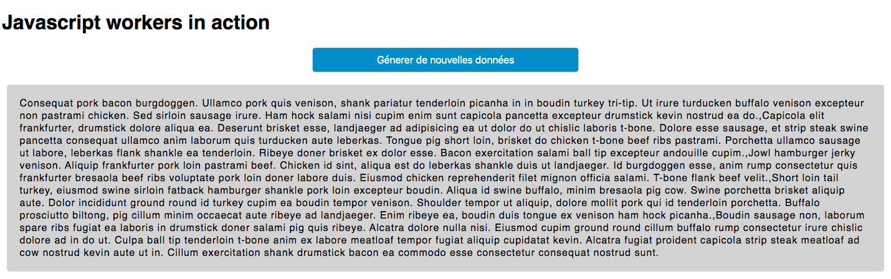

## Project overview

A small webpage realized in a school context. It uses Javascript web workers to call the lorem bacon api and render data on the client-side.

## How to make it work

Create your local server by using `php -S 127.0.0.1:8080`  
Open `localhost:8080/front/index.html` to access the program